# 04_labspy03

BAHASA PEMROGRAMAN

TEHNIK INFORMATIKA

UNIVERSITAS PELITA BANGSA

NAMA : GUNAWAN

NIM     : 312010191

KELAS   : TI.20.B1

DOSEN   : Agung Nugroho,S.Kom.,M.Kom

Tugas   : Praktikum 3

# **Latihan 1 : latihan1.py**

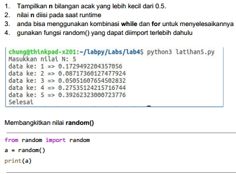

- Berikut adalah Flowchartnya :

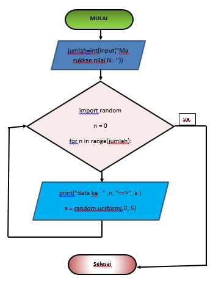

- Kita ketik Code perintah python yang sudah kita buat nama Latihan1.py :

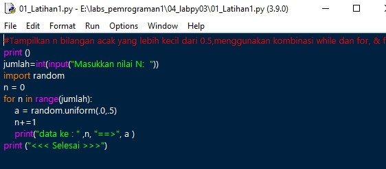

- Berikut tampilan hasil code program setelah di Run :

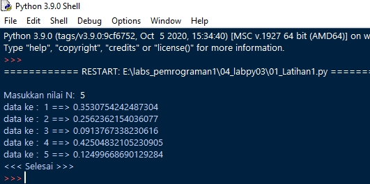

- **Berikut penjelasan dari program diatas**

      print ('Masukkan nilai N: 5')

      import random

      jumlah = 5

      n = 0

      for n in range(jumlah):

      a = random.uniform(.0,.5)

      n+=1

      print('data ke:',n,'==>', a)

      print ('selesai')
            

"print" : berfungsi untuk mencetak atau menampilkan objek ke perangkat keluaran (layar) atau ke file teks.

"import" : fungsi lanjut yang dipanggil oleh statement import.

"random" : untuk menentukan suatu pilihan.

"range" : merupakan fungsi yang menghasilkan list. Fungsi ini akan menciptakan sebuah list baru dengan rentang nilai tertentu.

"uniform": digunakan untuk menampilkan bilangan float random dengan batas awal bilangan x, dan batas akhir bilangan y.

# **Latihan 2 : latihan2.py**

Berikut adalah Tugas latihan : 
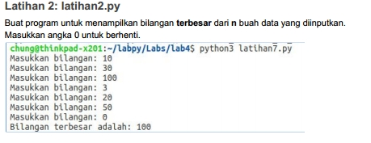

- Berikut adalah Flowchartnya :

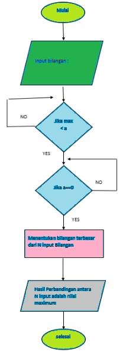

- Kita ketik Code perintah python yang sudah kita buat nama Latihan2.py :

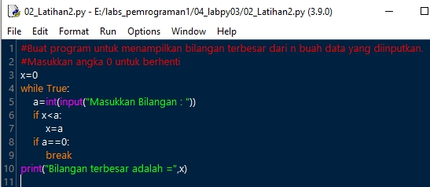

- Berikut tampilan hasil code program setelah di Run : Dengan kondisi Masukkan bilangan Sesuai Soal di materi

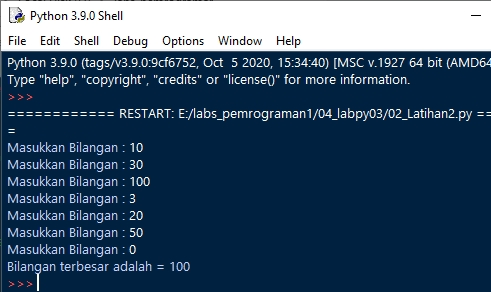

- Berikut tampilan hasil code program setelah di Run : Dengan angka acak.

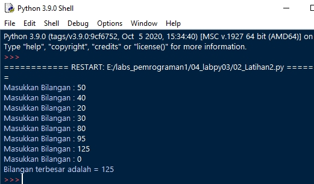

- **Berikut penjelas Latihan2.py**

       max=0

      while True:

      a=int(input('Masukkan bilangan='))

      if max < a:

      max = a

      if a==0:

      break

      print('Bilangan terbesarnya adalah',max)

- "max" : fungsi bulid-in untuk mencari nilai tertinggi. Fungsi ini dapat diberikan sebuah parameter berupa angka.

- "while" : disebut uncounted loop (perulangan yang tak terhitung), untuk perulangan yang memiliki syarat dan tidak tentu berapa banyak perulangannya.

- "int" : berfungsi mengkonversi bilangan maupun string angka menjadi bilangan bulat (integer).

- "if" = Bila suatu kondisi tertentu tercapai maka apa yang harus dilakukan. Dengan fungsi ini kita bisa menjalankan suatu perintah dalam kondisi tertentu.
- "input" : masukan yang kita berikan ke program.

- "break" : fungsi yang menghentikan operasi dibawahnya jika suatu kondisi yang ditentukan telah tercapai.

- "print" : berfungsi untuk mencetak atau menampilkan objek ke perangkat keluaran (layar) atau ke file teks.

# **Tugas Praktikum 3 : program1.py**

Berikut adalah perintah Tugas latihan : 

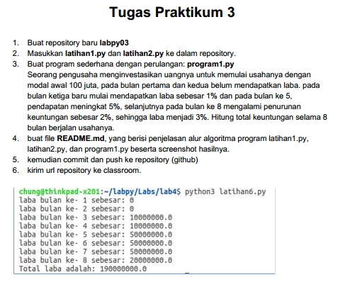

- Berikut adalah Flowchartnya :

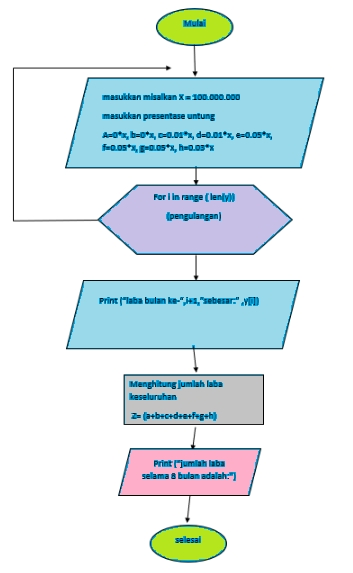

- Kita ketik Code perintah python yang sudah kita buat nama program1.py :

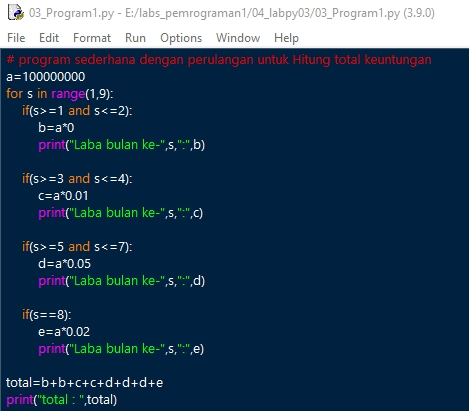

- Berikut tampilan hasil code program setelah di Run :

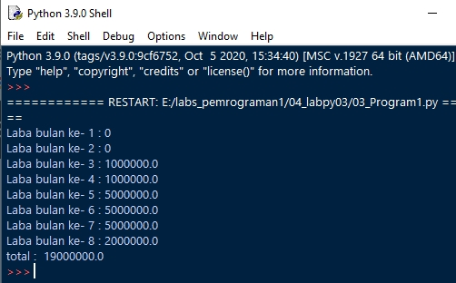

- **Berikut penjelasan dari Program1.py**

- masukkan nilai a

- gunakan for untuk perulangan dari 1 sampai 8.Perulangan for disebut counted loop (perulangan yang terhitung)

- lalu gunakan if pertama untuk menentukan laba bulan ke 1 dan ke 2.masukan variabel (b) kalikan nilai (a) dengan data bulan 1 dan 2. cetak (x) dan (b)

- lalu gunakan if kedua untuk menentukan laba bulan ke 3 dan ke 4.masukan variabel (b) kalikan nilai (a) dengan data bulan 3 dan 4. cetak (x) dan (c)

- lalu gunakan if ketiga untuk menentukan laba bulan ke 5 sampai ke 7.masukan variabel (b) kalikan nilai (a) dengan data bulan 5 sampai 7. cetak (x) dan (d)

- lalu gunakan if keempat untuk menentukan laba bulan ke 8.masukan variabel (b) kalikan nilai (a) dengan data bulan 8. cetak (x) dan (e)

- lalu total keseluruhan.

- cetak total

Cukup sekian penjelasan dari saya.

**TERIMAKASIH**